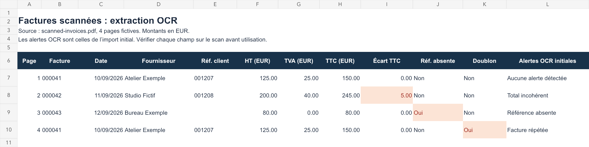

# PDF to Excel: text tables and scanned invoices

## Scanned French invoices

[Open the Excel result](invoice-ocr/outputs/01a087f4/factures.xlsx) · [View the source scans](invoice-ocr/outputs/scanned-invoices.pdf) · [Method and tests](invoice-ocr/README.md)

Four fictional image-only pages processed with French OCR. The workbook preserves invoice references and flags a missing client reference, a repeated invoice and a EUR5 total discrepancy. Clean synthetic layout only; no client work or general OCR accuracy claim.

## Text PDF table

A small, reproducible demonstration using **fictitious records, not client data or a previous client assignment**.

- [Source PDF](outputs/01a087f4/source.pdf)
- [Converted Excel workbook](outputs/01a087f4/converted.xlsx)
- [Excel preview](outputs/01a087f4/excel-preview.png)
- [Verification result](outputs/01a087f4/verification.json)

The PDF contains a ruled table with seven records. Its actual table content is extracted with pdfplumber and used to build the workbook. The workbook retains six-character reference strings, numeric quantities, numeric amounts and percentage values. Parenthesized negatives, minus signs, thousands separators and an intentional blank amount are represented appropriately. A blank remains distinct from zero.

All 40 table cells, including headers and the blank, were checked against the source fixture after PDF extraction and again after reopening the saved XLSX. PDF and spreadsheet previews were visually inspected. The workbook includes its source page reference.

This demonstrates one clean text PDF. It does not demonstrate OCR accuracy on scanned pages, arbitrary layout recognition, or completion of any client's files. Scanned documents require separate image review and ambiguity handling. Native Microsoft Excel rendering has not been tested.

## Reproduction

1. Run `fixture.py` with ReportLab to generate the synthetic PDF and expected values.
2. Run `extract.py` with pdfplumber to extract the PDF table.
3. Run `build.mjs` with the JavaScript `@oai/artifact-tool` package to author and render the workbook.
4. Run `verify.py` with openpyxl to independently read and check the saved workbook. The verifier never writes the workbook.

Prepared by CDRXRX.

## Image-only invoice OCR

[French invoice OCR sample](invoice-ocr/README.md): four synthetic scanned pages, Excel output, source traceability and anomaly checks. This separate example uses actual OCR; the original text-PDF example above remains unchanged.
